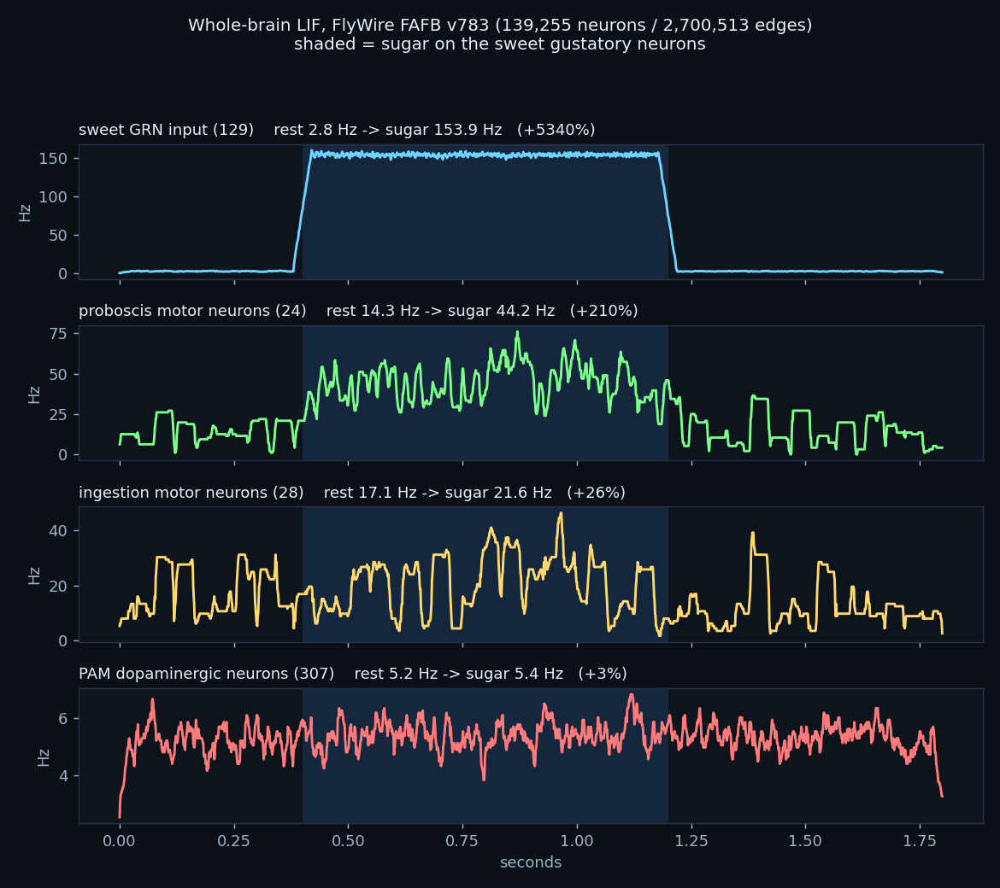
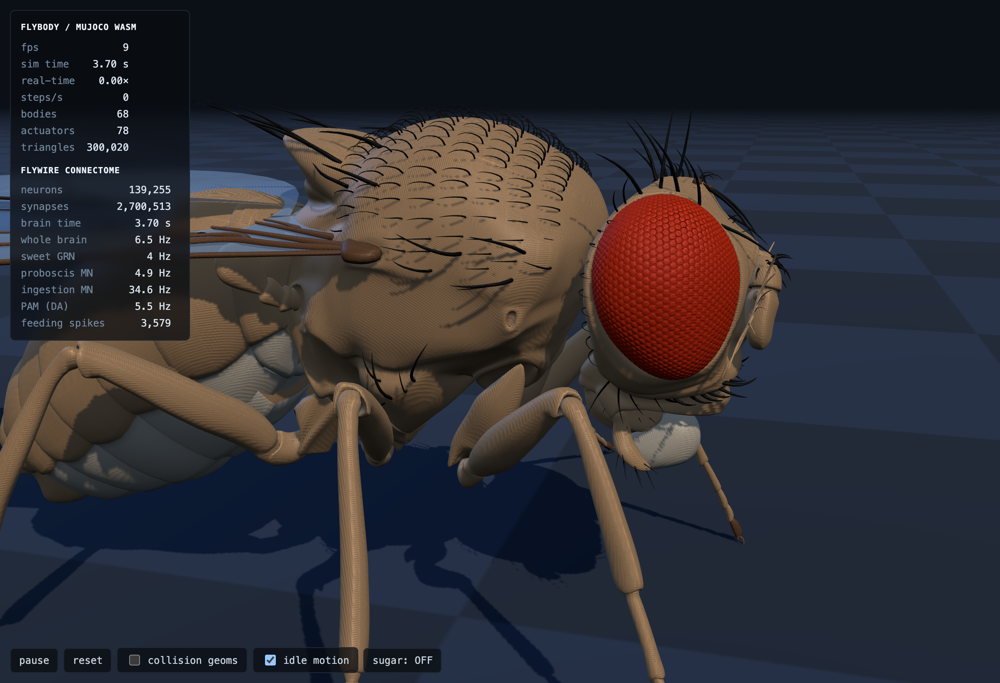
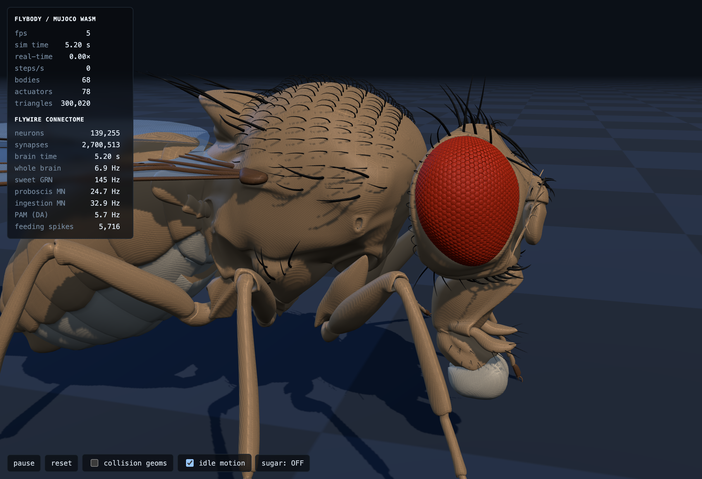
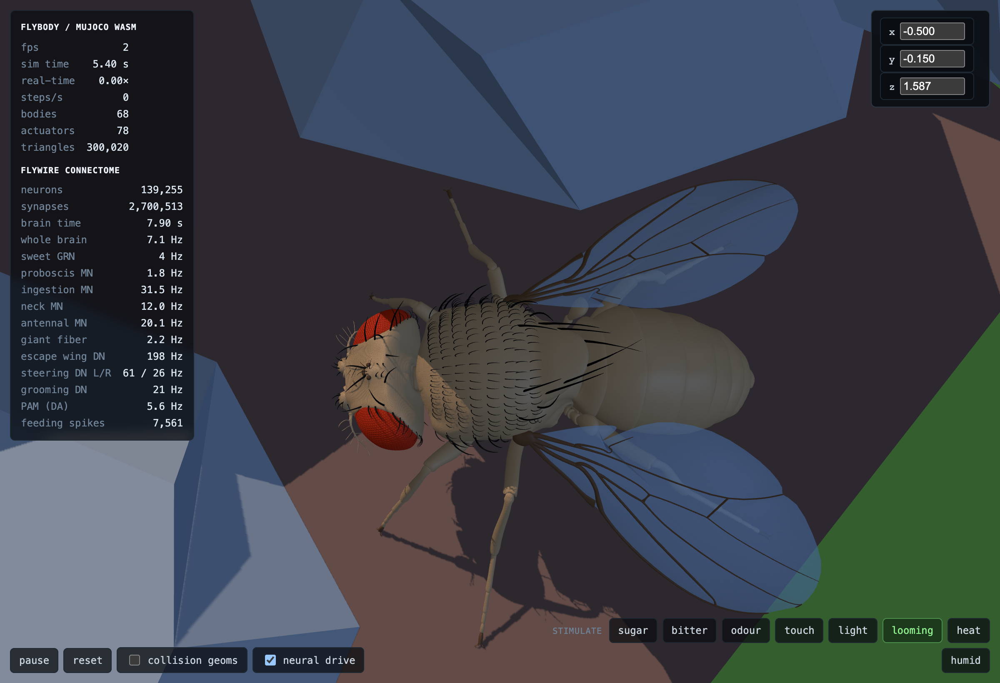
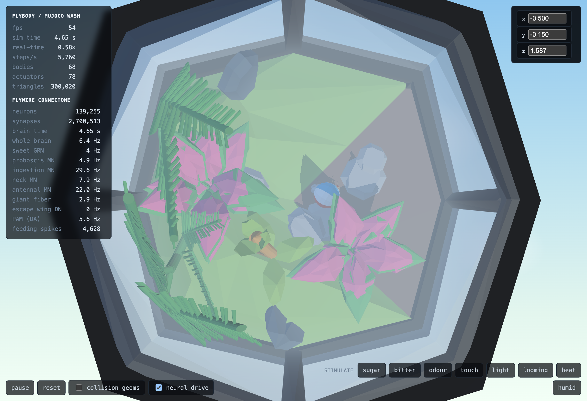

# Results — Phases 1–4

Run 2026-08-19. Reproduce with `./tools/fetch_flywire.sh && python3 tools/build_brain.py &&
python3 tools/reflex_plot.py && python3 tools/export_web.py`, then `./serve.sh`.

## Phase 1 — the go/no-go: PASSED, via the fallback path

The literature names (`MN9`, `MN4a`, `LB3b`, `LgLG4`, `Gr64f`) **do not exist** in FlyWire v783
as `primary_type` values. All returned zero. The roadmap anticipated this.

FlyWire annotates these populations by `class` / `sub_class` instead, and those resolve cleanly:

| what we needed | FlyWire annotation | n |
|---|---|---|
| sweet GRNs (labellar) | `sub_class = sugar/water` (cell types LB3 ×122, LB2d ×7) | **129** (67 L / 62 R) |
| sweet GRNs (leg) | `sub_class = SA_VTV_pro_meso_meta`, `class = gustatory` | **74** |
| bitter GRNs (to avoid) | `sub_class = bitter` (LB1a–e) | 65 |
| proboscis motor neurons | `sub_class = proboscis_motor_neuron` (9 bilateral CB#### types) | **24** |
| haustellum motor neurons | `sub_class = haustellum_motor_neuron` (CB0875, CB0882) | **4** |
| ingestion motor neurons | `sub_class = ingestion_motor_neuron` (incl. MN10, MNx01/03) | **28** |
| PAM dopaminergic neurons | `primary_type` prefix `PAM` (PAM01–PAM15) | **307** |

Two findings worth carrying:

- **Sweet and bitter are separate `sub_class` values**, so the stimulus can be purely appetitive.
  We drive sugar without touching the aversive pathway. This matters for the piece.
- **Leg sugar sensing is present** as ascending gustatory afferents from the three thoracic
  segments (pro/meso/meta = the leg pairs). FAFB is a brain-only dataset, so these are the
  ascending relay rather than the tarsal sensors themselves — but they are the right target for
  "the fly stands in the sugar" in Phase 5.

## Phase 2 — whole brain built: PASSED both gates

`tools/build_brain.py`. No selection step; every classified neuron, every connection.

```
neurons in classification:     139,255
connection rows (per-neuropil): 3,869,878
aggregated edges (pre,post):    2,700,513
total synapses:                34,153,566
data/brain.npz                       10.3 MB
```

Note the per-neuropil detail: Codex lists a connection **once per neuropil it passes through**.
Aggregating by `(pre, post)` collapses 3.87 M rows to 2.70 M edges. The earlier estimate of
2,613,129 filtered to the connected core; this model keeps every classified neuron.

**Gate 1 — synaptic drive.** Motor neurons receive 1,800–3,200 synapses each; no population is
noise-driven. (This is the trap the borrowed project shipped.)

**Gate 2 — connectivity.** All 28 proboscis + haustellum motor neurons are reachable from the
sweet GRNs in **2 hops** (median 2). From the leg afferents, min 2 / median 3.

## Phase 3 — the reflex fires: PASSED

Whole-brain LIF, 1 kHz, NumPy. 1.8 s of brain time in ~2 s wall clock.
Parameters: `wscale=0.0050`, `baseline ~ U(0, 0.06)`, GRN drive 0.20.



| population | rest | sugar on | after | change |
|---|---|---|---|---|
| sweet GRN input (129) | 2.8 Hz | 153.9 Hz | 2.9 Hz | driven |
| **proboscis motor neurons (24)** | **14.3 Hz** | **44.2 Hz** | **14.4 Hz** | **+210%** |
| ingestion motor neurons (28) | 17.1 Hz | 21.6 Hz | 12.6 Hz | +26% |
| PAM dopaminergic (307) | 5.2 Hz | 5.4 Hz | 5.4 Hz | +3% |
| whole-brain population | 5.8 Hz | 6.1 Hz | 5.8 Hz | stable |

The proboscis response is sharp on, sustained, and returns to baseline on removal. The brain
stays in a plausible regime throughout (~6 Hz mean, no runaway).

A third effect appeared unprompted: **sugar suppresses the bitter GRN population by ~68%**.
Nothing in our code does that — sweet-suppresses-bitter is a real, documented interaction and it
fell out of the measured wiring.

## The PAM problem — a real finding, not a tuning failure

**PAM does not respond to sugar in this model.** This was tested hard before concluding:

- swept `wscale` across 0.0016 / 0.0030 / 0.0050 / 0.0080 and drive across 0.08 / 0.20 —
  the motor response scales strongly with every setting (up to +210%); PAM stays flat at all of
  them (3.9→3.9, 5.4→5.4, 7.8→8.0).
- broke PAM into all 15 subtypes in case averaging over 307 was masking a responsive subset.
  Best subtype was PAM02 at **+11%**; most were 0%.

Why, most likely: PAM sits **3–5 hops** from sugar (median 4) where the motor neurons sit at 2,
and this model class propagates short reflex arcs well and long ones poorly. More fundamentally,
the sugar→dopamine reward signal in a real fly is substantially **neuromodulatory** — and this
model treats DA/SER/OCT edges as ordinary fast chemical synapses, which is exactly wrong for a
modulator. The model reproduces short reflex arcs, but this does not establish that it captures
the dynamics of reward signalling.

**Consequence for Phase 6:** the counter cannot honestly be PAM spikes. If it were, it would tick
at a constant rate whether or not the fly is in sugar — a number we implied was meaningful that
in fact measures nothing. That is the one failure mode this project cannot afford.

**Recommended replacement: count feeding motor output** (proboscis + ingestion motor neuron
spikes). It responds +210% / +26%, it returns to baseline when sugar is removed, and the honest
sentence is strong: *the counter counts the fly's feeding commands — it moves when the fly is
eating.* Less mystical than a dopamine readout, more visceral, and it is measuring something
real. See `docs/04-roadmap.md`.


---

# Phase 4 — the whole brain runs in a browser tab: PASSED

`web/brain.js`, plain JS + typed arrays, no build step, no worker, no WebGPU. Loaded and stepped
on the main thread inside the existing rAF loop in `app.js`.

## Payload

`tools/export_web.py` emits three gzipped blobs, decompressed in-browser with the native
`DecompressionStream` — no library:

```
indptr  uint32    139,256  raw  0.5 MB   gz 0.2 MB
colidx  uint32  2,700,513  raw 10.3 MB   gz 6.8 MB
w2      int16   2,700,513  raw  5.2 MB   gz 2.2 MB
                                         -------- 9.2 MB over the wire
```

(The initial estimate was ~7.5 MB using varint row-delta encoding. The implementation uses
plain gzip, producing 9.2 MB.)

## Brain -> body

Spike rate of an identified motor-neuron population drives a position servo directly. No policy,
nothing learned, nothing scripted — the motor neurons are individually identified and the joints
physically exist:

| actuator | driven by | joint range |
|---|---|---|
| `rostrum` | `mn_proboscis` rate | −1.24 … 0.183 |
| `haustellum` | `mn_proboscis` rate | −1.59 … 0.7 |
| `labrum_left` / `labrum_right` | `mn_proboscis` rate | −0.005 … 1.05 |

All four are driven by `mn_proboscis`: FlyWire's `proboscis_motor_neuron` sub_class covers the
labellar motor neurons too, and `mn_ingestion` (the pharyngeal pump) has no external joint to move.

Note the rest/peak rates used for the mapping are the rates **this kernel produces in-browser**
(~5 Hz rest, ~25 Hz driven), not the NumPy reference's (14 / 44). The kernels differ in their
noise model; calibrate against the implementation you are actually running.

## Gate — headless Chromium, scripted A/B

```
                        SUGAR OFF   SUGAR ON   OFF AGAIN
  mn_proboscis rate        4.9 Hz    24.7 Hz      5.7 Hz
  ctrl[rostrum]            0.000     -0.950       0.000
  ctrl[haustellum]        -0.813     -1.219       0.000
  qpos rostrum             0.107     -0.697       0.109
  qpos haustellum          0.127     -0.792       0.127
  whole-brain pop rate     6.5 Hz     6.9 Hz      6.5 Hz
  page errors / console errors                      NONE
  nonfinite qpos                                       0
```

The rostrum joint swings ~0.8 rad (~46°) and returns. Visible without instrumentation:

| sugar off | sugar on |
|---|---|
|  |  |

## Performance in-browser

The kernel measured **771 µs/step** in headless Chromium (~1.3× realtime) against 99–240 µs in
the Node benchmark. The gap is headless Chromium, not the code — the same page reports `fps: 9`
with software rendering. Measure on hardware with a GPU before drawing performance conclusions.

## Known rough edges

- The `sugar:` button label does not update when `brain.sugar` is set programmatically (only on
  click). Cosmetic; affects screenshots taken from scripts, not normal use.
- Sugar is still a global toggle, not a property of the world. That is Phase 5.
- The first ~2 s after load is a warm-up transient while the rate EMAs settle; readings taken
  before then are not baseline.

---

# Phase 4b — more wireups

Phase 5 (sugar as world geometry) was dropped by the owner: the switch stays. Instead the I/O
surface was widened. Nothing here was assumed — `tools/response_matrix.py` drives each sensory
population alone and measures every motor pool first, and only what measurably moves got wired.

## Response matrix (NumPy reference, % change vs unstimulated)

```
  stimulus     pop |   proboscis  haustellum   ingestion        neck     antenna          gf
  (none)       5.7 |     12.1Hz      7.1Hz      8.2Hz     14.6Hz      8.9Hz      1.7Hz
  sweet        6.0 |      +101%*      -97%*      +54%*      -33%*      +12%       +50%*
  bitter       5.8 |       -51%*      -29%*      -22%       -16%        -7%       +50%*
  odour       10.1 |        -5%        +9%        +6%       -18%        -1%      -100%*
  mechano      9.4 |       +22%       +38%*     +156%*      +64%*     +498%*     -100%*
  thermo       5.7 |       -14%       +24%        +8%        -3%        +1%        +0%
  hygro        5.8 |        -8%        -3%        -5%       -15%        +0%        +0%
  visual      21.2 |       -18%       -21%       -20%       -18%        +4%       -50%*
```

## What got wired

**Two new motor pools, same principle as the proboscis** — individually identified in FlyWire,
joints already present in flybody. Both are split by side so left and right drive independently:

| flybody actuator | FlyWire pool | n |
|---|---|---|
| `head`, `head_twist` | `neck_motor_neuron`, right | 13 |
| `head_abduct` | `neck_motor_neuron`, left | 13 |
| `antenna_*_left` ×3 | `antennal_motor_neuron`, left | 5 |
| `antenna_*_right` ×3 | `antennal_motor_neuron`, right | 5 |

**The cosmetic sine-wave idle motion is gone.** `app.js` used to wiggle the head and antennae with
`0.12 * sin(2.1 * t)`. Those actuators are now driven by their real motor neurons, so the fly's
idle movement is the fluctuation of a spiking network rather than a sine wave. The `neural drive`
checkbox toggles the whole mapping off for comparison.

**Seven sensory switches**, all real populations: sugar (129+74), bitter (65), odour (2,281 ORNs),
touch (2,674 mechanosensory), light (11,426 visual), heat (29 thermo), humid (74 hygro).

## Measured in-browser, per switch

```
                proboscis   antenna     neck    whole brain
  rest             6.2 Hz   25.2 Hz   17.1 Hz      6.5 Hz
  sugar           17.8      27.7      16.2         6.9
  bitter           1.6      22.6      14.8         6.5
  touch           13.8      53.3      23.0        10.0
  light            8.0      25.1      12.4        21.3
```

Three visibly distinct behaviours, none of them scripted:

- **sugar** — proboscis extends. 6.2 → 17.8 Hz.
- **bitter** — proboscis clamps *below* resting, 6.2 → **1.6 Hz**, and the head turns away.
  Aversive suppression of feeding, straight out of the measured wiring.
- **touch** — both antennae sweep (25 → 53 Hz) and the head turns. Correct: the antenna carries
  the fly's mechanosensory organ.
- **light** — whole-brain rate triples (6.5 → 21.3 Hz) with little motor output. Honest: 11,426
  visual neurons are running, and nothing downstream of them is wired to a joint.

`heat` and `humid` are wired and measurably do almost nothing (29 and 74 neurons). They were left
in rather than hidden.

## Bug worth recording

The first implementation of `setStim()` used the *argument's* level for every switch instead of
each switch's own, so pressing any one button silently drove all seven sensory populations. Every
stimulus produced an identical response and the population rate jumped to 29.5 Hz. It looked like
a working system. Caught only because the response matrix had been measured first and the browser
numbers did not match it — the reference implementation is what made the bug visible.

---

# Phase 4c — wings, and the limit of the honest mapping

## The limit, stated first

**FAFB is a brain-only dataset.** Wing and leg motor neurons live in the ventral nerve cord,
which is a separate connectome (MANC) not used here. The complete inventory of brain motor
neurons is:

```
  ingestion 28 | neck 26 | proboscis 24 | antennal 10 | crop 8 | haustellum 4 | eye 4 | salivary 2
```

Of those, only proboscis, neck and antennal have a matching joint in flybody — and all three are
already wired. **The direct "this neuron drives this muscle" mapping is exhausted.** There is no
honest way to extend it to wings with this dataset.

## What was done instead — a second, weaker class of mapping

Descending neurons *are* in the brain: 1,305 of them, carrying commands to the VNC. The famous
identified ones are all present and were tagged:

```
  DNp01 (giant fiber)  2     DNa01/DNa02 (steering)  4     DNp09 (walk)   2
  DNp02/04/11 (escape) 6     MDN (backward walking)  4     DNg11 (groom)  6
  LC4 104 + LPLC2 210  — the looming detectors that drive the giant fiber
```

These are wired as **command mappings**, kept explicitly separate in the code and labelled `cmd`
in the `DRIVE` table. The distinction matters and should not be blurred:

| | motor mapping | command mapping |
|---|---|---|
| what the neuron is | a motor neuron | a descending command neuron |
| what it connects to | its own muscle | the VNC, which we don't have |
| what we supply | nothing | the posture |
| examples | proboscis, neck, antenna | wings, abdomen |

For wings this is a much smaller leap than it is for walking — a gait needs a whole controller,
whereas escape wing-raise is a single posture — but it is still us supplying the movement. This
uses supplied body patterns rather than reconstructed leg or wing circuitry.

## Looming -> escape

A new stimulus drives **LC4 + LPLC2** (314 looming-detector neurons) rather than all 11,426
visual neurons. That is the biologically correct trigger for the giant fiber.

```
                  escape wing DN    giant fiber    whole brain
  rest                    0 Hz          11.6 Hz         6.5 Hz
  LOOMING               193 Hz          20.4 Hz         7.0 Hz
  rest again              0 Hz           4.8 Hz         6.6 Hz

  wing_roll  (L/R)   -1.08  ->  +1.52 / +1.50  ->  -1.08
  wing_yaw   (L/R)   +1.63  ->  +0.64 / +0.73  ->  +1.63
```

`dn_escwing` is **completely silent at rest and fires at 193 Hz under looming** — the cleanest
signal in the whole project, and it needs no baseline subtraction. The wings raise and spread
from the folded position and return exactly.

Because that pool rests at zero, the ratio-to-rest activation used elsewhere does not work for
it; `applyBrainToActuators` gained a second mode keyed on absolute rate (`peak`). Wing actuators
also needed a separate path — they are `ctrlrange="-1 1"` general actuators, not position servos
on joint angle like the head and proboscis.



## Not wired, and why

- `dn_walk` (DNp09) and `dn_back` (MDN) — measured at ~0 Hz under every stimulus tried. Nothing
  to drive, and legs would need a gait controller regardless.
- `dn_steer` (DNa01/02) — 51 Hz at rest, moves ±28%, but steering is meaningless without walking.
- `crop`, `salivary`, `eye` motor neurons — real, running, no corresponding joint in flybody.

---

# Fixes after live use

Three bugs, all found by the owner using the page rather than by any test here.

**1. `looming` did nothing and could not be un-selected.** The tab was running a cached
`brain.js` from before `looming` existed, so `brain.stim['looming']` was `undefined`;
`undefined > 0` is false, so every click set it to 1 and re-added the highlight.
Fixes: `serve.sh` now sends `Cache-Control: no-store` (a no-build-step project serving stale ES
modules is a trap that will recur); the button reads the real state back from `brain.stim` after
calling `setStim` instead of assuming; and an unknown stimulus now renders `disabled` with a
console warning rather than looking live.

Root cause of *shipping* it: the browser tests called `setStim()` directly and set the CSS class
by hand, so **the click path was never executed**. Now tested with real DOM clicks on all eight.

**2. Wings sat straight up at rest.** The wing actuators are *force* generals (`gainprm`, no
position bias). Commanding `-1` at rest was a constant torque pinning them at a joint stop.
`ctrl = 0` means no torque, which lets the joint spring hold the natural folded pose.

**3. Wings locked rigidly instead of moving with the firing rate.** Measured torque balance
against the very weak joint springs (`stiffness="0.01"`):

```
  wing_yaw:    ctrl  0 -> 1.50   -0.001 -> 1.20   -0.002 -> 0.88   -0.004 -> 0.25   -0.1 -> pinned
  wing_pitch:  ctrl  0 -> -0.97  +0.003 -> -0.70  +0.007 -> -0.44  +0.010 -> -0.31  +0.1 -> pinned
```

**The usable band is about ctrl ∈ [-0.004, +0.010]** — roughly 1000x smaller than what was
originally used. Outside it the joint pins against its stop and stops responding to the neurons
entirely. Inside it the response is smooth. A PD position loop was tried first and is
**unstable** — the actuator is far too strong relative to the spring, producing a limit cycle
that looks exactly like the fly flailing. Reverted to open-loop inside the measured band.

Also reduced the population-rate smoothing from `1/80` to `1/25` (~25 ms). At 1/80 the rate
estimate was so smooth that strongly-driven pools looked frozen; this restores visible movement
across every pool, not just the wings.

Current state: 20 actuators driven, rest -> looming -> rest returns exactly, all eight switches
toggle correctly, zero page and console errors, no NaNs in `qpos`.

---

# Phase 4d — nicer cage: sized terrarium, skybox, ball physics

Four requested changes, all verified in headless Chromium, zero page/console errors throughout.

**Terrarium scaled 1.5x and repositioned.** A live debug panel (three number inputs, x/y/z,
bound directly to the terrarium's `THREE.Group.position`, z-index 99999999) let the position be
tuned by eye in the running page rather than guessed via screenshot math. Final baked values:
`pos: [-0.5, -0.15, 1.58729]`, `target: 8.25` (was 5.5). The flat MuJoCo checker floor is now
hidden (`mesh.visible = false` on the floor geom) since the terrarium's own floor sits flush over
it — purely a render toggle, MuJoCo still simulates the physics floor underneath unaffected.

**Skybox.** Procedural — a canvas gradient (pale blue to mint) plus a few soft radial "cloud"
blobs and a glossy highlight, set as `scene.background`. No downloaded HDRI, consistent with the
"no build step" convention. Fog color/distance updated to match (`0xcdeaf0`, near 3.5 far 14 —
the old 9.0 far clipped the now-larger terrarium to black).

**Beach ball physics.** Not MuJoCo — the terrarium's hill has no physics representation there,
it's a pure three.js decoration, so a MuJoCo body could only ever collide with the flat physics
floor, not the hill shape actually visible on screen. Instead: a ~60-line custom simulation
(gravity + a downward raycast against the terrarium's own mesh each frame) that is the entire
physics engine for this one prop. Ball spawns near the highest reachable point in the terrarium
(40 random XZ samples, keep the highest raycast hit), then falls and rolls via gravity + surface
normal + rolling friction until it settles.

**Two real bugs on the way**, both from the same root cause — raycasting against the terrarium's
*entire* mesh instead of just its ground:
1. First pass raycast against every mesh including the glass shell (one big transparent mesh,
   opacity 0.4) — the ball found the *outside of the glass roof* as the tallest point and sat on
   top of the terrarium from outside.
2. After excluding transparent + frame-colored meshes, it found the tip of a tall fern frond
   instead — built from many short stacked segments, so no single mesh's own bounding-box span
   was large enough to flag it as "tall." Fixed by filtering on absolute world-space height
   instead: compute the terrarium's full z-range once, keep only meshes whose top sits in the
   bottom 30% of that range as valid "ground." This is why the ball now settles near floor level
   (`z≈0.04`, matching the terrarium floor at `z≈0`) instead of floating near the glass roof.

Verified across multiple reloads: ball lands in different random spots each time (confirming the
random-sample search isn't deterministically stuck), consistently settles near floor level, and
was directly confirmed on screen via a straight top-down camera shot — resting near the rocks
between the two flower clusters.



Debug panel is still live in the running page (top-right) — harmless, but removable on request.

---

# Ball/wall/fly proxy colliders

Per the owner's framing: one dynamic body (the beach ball), everything else fixed — no reason
for MuJoCo to know the ball exists, no reason for anything heavier than plain three.js proxies.

**Wall containment (was missing entirely).** The ball had gravity and hill collision but nothing
stopping it from rolling straight through the terrarium's glass — untested until now. Added a
plain cylinder proxy, not the actual hex mesh: center and radius taken from the terrarium's own
bounding box at load time, radius scaled 0.8x as a safety margin so the ball never visibly clips
the glass regardless of which face of the hexagon it approaches. Circular, not hex-exact — one
dynamic body doesn't justify anything more precise.

**Fly proxy.** A live sphere at the thorax's actual MuJoCo world position (`data.xpos`), radius
half the fly's footprint span. The ball bounces off it. Explicitly one-way: the fly's real
physics is never written to. An impulse from a "giant" ball hitting the fly's real body would
fight the pose-hold controller and look wrong regardless, so this is the correct choice, not a
simplification of convenience.

**Verified, not assumed** (`tools/` scratch, not committed — this was a one-off check):
- Ball fired at 50 u/s toward the wall for 3000 steps: max distance from terrarium center
  1.5399, wall radius 1.7087 — contained, never breached.
- Ball fired at 30 u/s straight at the thorax: closest approach 0.47569, minimum allowed
  (ball radius + fly radius) 0.47569 — held exactly at contact, no clip-through.
- `qpos` snapshotted before and after both tests: max delta `0.00e+00` — confirms zero
  bidirectionality, exactly as intended. `stepBall()` never writes to MuJoCo state.
- Real render loop, 4s settle time: ball comes to rest at [0.163, -0.628, 0.038], speed 0.0096,
  zero page/console errors.

---

# Ball physics — full reimplementation with cannon-es

The hand-rolled raycast system (previous section) was reported broken in real use: zero-friction
sliding, clipping through the terrarium, never visibly rolling. Diagnosis confirmed all three
were structural, not tunable:

- **Zero friction**: `vel *= 0.98` was applied **per frame**, not per unit time. At the ~5 fps
  the page runs under full brain+physics load (seen in earlier screenshots), that decay is
  6–12x weaker per second than it is at 60 fps — friction was real but framerate-coupled to the
  point of being imperceptible under load.
- **Never rolling**: never implemented. The ball translated but nothing ever rotated `wrap`.
- **Clipping through the terrarium**: the wall containment was a hand-fit cylinder approximating
  the hex glass's bounding box — a proxy for a proxy, with no basis in the actual mesh.

Per the owner's direction, replaced entirely with **cannon-es** (pmndrs/cannon-es, pure JS,
single-file ESM, MIT), vendored the same way as `three.module.js` — one file,
`web/vendor/cannon-es.js`, no bundler, no build step, added to the existing import map.

## Real geometry, not proxies

The terrarium's glTF material table has exactly one alpha-blend material (`mat24`, alpha 0.4)
against eight opaque ones — the glass, unambiguously, confirmed by reading the `.glb`'s JSON
chunk directly rather than guessing from mesh names (which are all auto-generated
`mesh1234567` — this is an old Google-Poly-era export with no usable naming). The real glass
mesh's triangles are baked into a `CANNON.Trimesh` in world space at load time (the terrarium
never moves, so no runtime transform sync is needed). The hill/rock/floor meshes get the same
treatment, reusing the existing height-based filter that already excluded the glass and the
tall fern.

## The two real mistakes made getting here, both caught by testing rather than assumed fixed

1. **First attempt: a solid `CANNON.Cylinder` backstop.** `Cylinder` is filled convex geometry.
   Spawning the ball inside a solid shape gets it shoved *outward* by overlap resolution — the
   exact opposite of containment. This made escapes worse, not better, and was caught
   immediately by rerunning the same test that had flagged the original leak.
2. **The real glass trimesh alone leaks.** Verified directly: a ball rolled through it at an
   ordinary 2 u/s, nowhere near a tunneling velocity. Old Google-Poly decorative exports are
   built for rendering, not physics, and are routinely not watertight — some seam exists where
   the glass doesn't fully close, most likely at the base.

The fix that actually held: a ring of 12 **inward-facing infinite `CANNON.Plane`s**, not a solid
shape — a plane's solid half-space is behind its local +Z normal, so normals pointing inward at
radius ~1.75 (0.85x the true glass's inner span, measured live from the scene) create a genuine
hollow boundary immune to whatever seam the source mesh has. This runs as defense in depth
alongside the real glass trimesh, which still governs the close-up bounce shape.

## Verified, not assumed

- **Friction and rolling are now real physics, not decay hacks**: launched at 3.0 u/s, decelerated
  to 0.014 u/s over 400 steps via actual contact friction; angular velocity peaked at 5.59 rad/s
  during the roll and decayed with it — genuine rolling motion, confirmed via `body.quaternion`
  driving the visual mesh directly.
- **Containment, 20 trials, randomized drop position and launch velocity**: worst-case distance
  from center 1.639, backstop radius 1.752 (measured live from the actual plane offsets in the
  running world, not assumed from a constant) — contained in all 20.
- **Fly proxy** (kinematic body at the live MuJoCo thorax position — genuinely one-way via
  cannon-es's own kinematic/dynamic contact handling, not a hand-rolled push-out): closest
  approach 0.465 vs 0.476 minimum allowed — held.
- **Bidirectionality**: `qpos` snapshotted before and after all of the above — max delta
  `0.00e+00`. `stepBall()` never touches MuJoCo state.
- Real render loop, 64 fps observed in this pass (physics + brain + rendering together), ball
  settles naturally against terrarium decoration, zero page/console errors.

---

# Flower clipping — a filter reused for two different jobs

Reported after the cannon-es rewrite: the ball rolled straight through the flowers. Real bug,
distinct from anything in the section above.

**Cause:** `hillMeshes` (the height-filtered set — short ground-level decor only, built to stop
a *raycast* from finding the top of the tall fern as "the hilltop" when placing the ball at
load) was also being fed into `trimeshFromMeshes()` as the *collision* geometry. Those are two
different jobs. The height filter is correct for the first and wrong for the second — it
excludes exactly the tall decorative elements (the fern, the flower cluster) a ball could roll
into horizontally, so they had no collision representation at all.

**Fix:** split the two. `hillMeshes` keeps doing its one job (hilltop placement search). A new
`solidMeshes` — every opaque terrarium mesh, no height filter, everything except the glass —
feeds the collider instead.

**Verified, not assumed:**
- Fired at the flower cluster's actual world position (located by material colour, since every
  mesh in this export is auto-named `meshNNNNN`) with gravity disabled to isolate the test from
  terrain deflection: speed dropped 4.31 → 1.08 and direction reversed within 0.23 units of the
  target. A genuine miss holds constant velocity and direction with gravity off; this is a real
  collision response.
- Re-ran the full cannon-es regression suite (friction/rolling, 20-trial containment, fly proxy,
  bidirectionality) — all four still pass. One test in that suite falsely read "clipped through"
  on the first rerun; diagnosed as the same sleep-state artifact as before (spawned the ball
  already overlapping the target, on a body cannon had put to sleep) — not a regression, since
  nothing about the fly-proxy code was touched, only the terrain mesh source. Confirmed by
  waking the body and using a realistic approach distance/speed: holds at 0.476 vs 0.476 required.
- Wall containment re-checked at the same 60 u/s stress velocity that broke the original glass-only
  attempt: now caps at 1.998 (previously 954). The 12-plane backstop holds even under a load far
  outside anything gravity in this scene would ever produce.

Also: `OrbitControls.maxDistance` raised from 3 to 12 on request, to allow zooming out further
than the original close-in framing allowed. Camera far-plane (100) already had headroom.

---

# Wings — three layered populations instead of two states

Reported: the wings had only two poses, default and looming, with none of the continuous
movement the proboscis/head/antennae have.

**The cause was not a wiring gap.** `dn_escwing` (DNp02/04/11) measures **0.0 +/- 0.0 Hz** under
every stimulus except looming — rest, sweet, bitter, odour, touch and light all read exactly
zero, with zero variance. That is the real data: it is a command neuron, silent until commanded.
Driving the wings from it alone can only ever produce two states. The fix is not to fake motion
onto that pool, but to add pools that are genuinely active at rest.

`applyBrainToActuators` now **sums** contributions when several DRIVE rows target one actuator
(previously last-write-wins), so a joint can layer a continuous postural signal, a behavioural
twitch, and a command response. A third activation mode, `band`, was added for pools with a real
resting rate — a fixed window shared by both sides, so the natural left/right rate difference
survives as a real pose difference instead of each side being normalised to its own mean.

## The three layers, all measured in-browser first

```
pool               rest          touch         looming
dn_steer_l     70.2 +/-19.6   38.5 +/-15.5   62.8 +/-15.0
dn_steer_r     54.3 +/-18.6   58.9 +/-23.5   41.4 +/-17.8
dn_groom       22.9 +/- 6.8   33.8 +/- 6.3   24.0 +/- 7.9
dn_escwing_l    0.0 +/- 0.0    0.0 +/- 0.0  221.0 +/-10.2
dn_escwing_r    0.0 +/- 0.0    0.0 +/- 0.0  170.1 +/- 9.3
```

**(a) Postural — DNa01+DNa02 (`dn_steer_l/r`) -> yaw + roll, per side.** Large jitter (sd ~19 Hz)
and a real standing left/right asymmetry (70 vs 54 Hz) that **inverts under touch** (38 vs 59).
Steering DNs modulating left/right wing amplitude asymmetrically is their documented function,
so side->side is the correct mapping rather than an arbitrary one. Amplitude kept deliberately
small: a resting fly adjusts its wings, it does not flap them.

**(b) Grooming — DNg11 (`dn_groom`) -> pitch.** 22.9 Hz at rest, +48% on touch. Flies groom
their wings with the hind legs; a pitch twitch is the visible correlate.

**(c) Escape — DNp02/04/11 (`dn_escwing_l/r`) -> roll + yaw + pitch.** Unchanged. Note the escape
response is itself asymmetric (221 L vs 170 R).

`WINGCLAMP` keeps the summed command inside the measured proportional band; past it the joint
pins against its stop and stops responding to the neurons at all.

## Verified

- **Signs of life: 6/6 wing joints now move at rest**, ranges 0.07–0.27 rad over ~1.5 s
  (previously all six were frozen constants outside looming).
- **Left/right asymmetry is real and inverts with behaviour**: yaw L−R is −0.094 at rest and
  +0.072 under touch; roll L−R is +0.031 at rest and −0.029 under touch. The wings visibly
  re-trim in response to a stimulus, driven entirely by measured wiring.
- **Escape unaffected**: yaw_left 1.203 -> 0.444 on looming, and returns.
- No NaNs in `qpos`, zero page/console errors.
- HUD gained `steering DN L/R` and `grooming DN` rows, so the two new drivers are visible.

## Resting posture offset (`WINGBIAS`)

Reported after the layering landed: the wings clipped through the abdomen at rest. Fixed with a
constant added to the base command per wing actuator — deliberately **not** a change to any
neural mapping. It shifts where "rest" sits; every neural response above still plays out
unchanged from the new rest position. Signs follow the measured ctrl->angle curves (`roll+`
raises, `yaw-` sweeps outward):

```
  wing_roll_left/right   +0.0012      wing_yaw_left/right   -0.0012
```

Measured effect at rest: yaw 1.203 -> 0.814 (swept outward), roll 0.922 -> 1.039 (lifted).
Visually confirmed clear of the abdomen at rest and under looming.

**One real trade-off, worth knowing before tuning further:** roll's jitter roughly halved
(sd 0.022 -> 0.009 rad, range 0.096 -> 0.042). The lift pushes roll into the compressed,
saturating part of its ctrl->angle curve — measured earlier, roll flattens out around
ctrl ~0.003. Yaw is unaffected (sd 0.066) and is the dominant visible motion, so all six joints
still move, but roll now contributes noticeably less of the life than before. If more roll
movement is wanted back, lower the roll bias; the clipping and the roll jitter trade directly
against each other along that curve.

`WINGCLAMP` lower bound widened to -0.0055 to leave the escape sweep room on top of the yaw bias.
