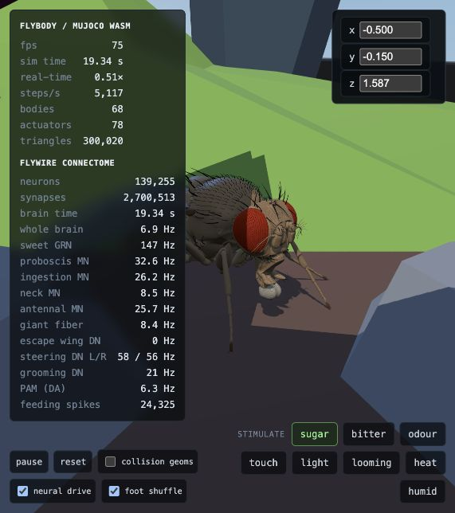

# Neural shuffle in place

Implemented 2026-09-05. Owner direction supersedes the earlier walking discussion: occasional
foot adjustments and weight shifts, with no need to travel around the terrarium.

## What drives it

The existing DNg11 (`dn_groom`) population rate accumulates into a movement request: eight
population-equivalent spikes trigger one adjustment. Only idle time after the settling interval
contributes to the next request. There is no added random timer or periodic autonomous gait.
Silent command neurons cannot trigger new movements. This integrates the existing smoothed
population rate, rather than counting individual spikes exactly.

The supplied pattern visits front-left, rear-right, middle-left, front-right, rear-left,
middle-right in turn. Only one leg receives a lift pulse at a time; the other five retain their
standing actuator targets. The active side's DNa01/DNa02 (`dn_steer_l/r`) activity scales the
movement, and grooming rate sets its duration. Each pulse lasts approximately half a simulated
second, followed by a 0.2-second settling interval and another period of neural accumulation.

Femur/tibia offsets produce a modest flexion and return. A smooth envelope and 25 ms filter
avoid abrupt starts and lower the foot gently if either shuffle or neural drive is disabled.
Commands are bounded by the existing actuator control ranges. All body displacement comes from
MuJoCo dynamics: no root repositioning, thorax forces, or anchoring constraint is added.

**Claim boundary:** these are real descending neural signals controlling an authored foot
adjustment pattern. This is not reconstructed leg circuitry, walking learned by the connectome,
or a demonstrated biological DNg11-to-joint mapping. It uses the same class of explicit command
mapping already used for the wings. No neurons, edges, gains, stimuli or plasticity were changed.
Upstream model XML is unchanged. The environment still does not send contact feedback into the
brain; this change adds motor expression, not a new sensory feedback loop.

## Clock and controls

The brain now advances one millisecond for every ten MuJoCo steps, within the same frame budget.
Previously it ran in frame-sized batches and compared absolute brain age against body time;
calibration started it 2.5 seconds ahead, and resetting the body froze it until body time caught
up. Reset now preserves the brain and records its age as the new body-session origin. The HUD
shows elapsed brain time since that origin, while `brain.ms` remains the brain's lifetime clock.
Brain state and the feeding counter survive a body reset as before.

`foot shuffle` allows comparison with the held stance independently of other neural motion.
`neural drive` also suppresses the shuffle. Pause freezes both the fly and the ball.

## Verification

Run `npm run typecheck` and `node tools/shuffle_test.mjs`. The latter executes the actual
controller functions from `app.js` with the vendored MuJoCo WASM, upstream body assets, and
current JavaScript brain kernel. It does not substitute an animation or a different physics
implementation. The extraction uses the pose-hold/main section markers; retain these markers
or update the harness if this section is moved.

Measured after the initial one-second settling period, over twelve further simulated seconds:

- All six feet visited; 12 movement requests.
- Maximum horizontal displacement from the settled start: 0.00715 model units.
- Maximum foot rise relative to its settled starting height: 0.00229 model units.
- Maximum body rotation from the settled start: 0.0410 radians (2.35 degrees).
- Thorax Z stayed between -0.00936 and -0.00531 model units.
- Sugar still increased proboscis output; all sensory switches together produced finite state.
- With neural motion disabled, maximum joint speed decayed from 0.357 to 0.0192 over two seconds.
- Silent shuffle-command inputs produced no new requests.
- After a body reset, ten simulated milliseconds advanced the preserved brain by exactly ten ms.

Browser verification also reads `window.fly` through a temporary same-origin diagnostic page:
all six feet visited, no nonfinite qpos, stable position over more than 25 simulated seconds,
and brain/body clock separation below one millisecond, including after reset. No browser console
errors or warnings were observed. A small amount of physical drift is allowed; the body is not
pinned in place. This is a short-run stability check, not a claim of indefinite bounded position.
